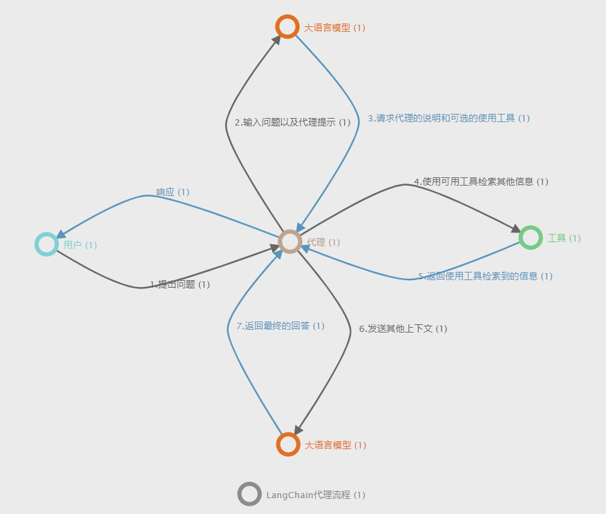

# Langchain2ONgDB
>&emsp;&emsp;LangChain 是一种 LLMs(大语言模型) 接口框架，它允许用户围绕大型语言模型快速构建应用程序和管道。
>`Langchain2ONgDB` 是参考 [Langchain2Neo4j](https://github.com/tomasonjo/langchain2neo4j) 的实验项目，将ONgDB集成到了`LangChain`生态系统。
>在`Langchain2Neo4j`的基础上去掉了`Keyword search(关键词全文检索)`和`Vector search(向量检索)`功能，只保留了基础的`Cypher`生成工具，并跑通了一个 [中文数据集案例](https://github.com/ongdb-contrib/graph-qabot-demo/tree/main/db) 。
>如果对去掉的两个工具感兴趣可以查看 [Langchain2ONgDB历史仓库](https://github.com/ongdb-contrib/langchain2ongdb/tree/main) 。


1. [Langchain2ONgDB分支：main](https://github.com/ongdb-contrib/langchain2ongdb/blob/main) ，设置OPENAI_KEY后跑通了英文数据集

2. [Langchain2ONgDB分支：1.0](https://github.com/ongdb-contrib/langchain2ongdb/blob/1.0) ，设置OPENAI_KEY后跑通了中文数据集

3. [~~Langchain2ONgDB分支：2.0~~](https://github.com/ongdb-contrib/langchain2ongdb/blob/2.0) ~~，设置封装的GPT的HTTP接口后跑通了中文数据集~~

## LangChain代理流程
>&emsp;&emsp;代理流程在接收到用户输入时启动。
> 然后，代理向 LLM 模型发送请求，其中包括用户问题和代理提示，代理提示是代理应该遵循的一组自然语言指令。
> 反过来，LLM 会向代理人提供进一步的指示。
> 对于工具的使用大多数情况下，我们的第一反应是使用可用的工具从外部来源获取更多信息。
> 但是，工具不限于只读操作。例如，您可以使用它们来更新数据库。在该工具返回附加上下文后，将对包含新获得的信息对 LLM 进行另一次调用。
> LLM 可以选择返回给用户最终生成的答案，或者它可以决定需要通过其可用工具执行更多的操作。
> 对于每一个输出（Observation）之后会紧跟着一个思考（Thought），思考下一步做什么，如果发现任务全部完成就输出最终答案。
```json
// 导入 https://ongdb-contrib.github.io/graphene/app/ 查看可视化效果
{"data":{"nodes":[{"x":235,"y":448,"color":"#80d0d6","label":"用户","properties":[{"id":"a2938fae","key":"id","type":"ID","defaultValue":"","limitMin":"","limitMax":"","isRequired":true,"isAutoGenerated":true,"isSystem":true,"description":""}],"id":"a8a09d86","isSelected":false,"isNode":true},{"x":521,"y":189,"color":"#E16F23","label":"大语言模型","properties":[{"id":"a2903785","key":"id","type":"ID","defaultValue":"","limitMin":"","limitMax":"","isRequired":true,"isAutoGenerated":true,"isSystem":true,"description":""}],"id":"ad9a5489","isSelected":false,"isNode":true},{"x":522,"y":686,"color":"#E16F23","label":"大语言模型","properties":[{"id":"aba6f9a3","key":"id","type":"ID","defaultValue":"","limitMin":"","limitMax":"","isRequired":true,"isAutoGenerated":true,"isSystem":true,"description":""}],"id":"a0834ab1","isSelected":false,"isNode":true},{"x":810,"y":440,"color":"#76cb84","label":"工具","properties":[{"id":"a1a4da97","key":"id","type":"ID","defaultValue":"","limitMin":"","limitMax":"","isRequired":true,"isAutoGenerated":true,"isSystem":true,"description":""}],"id":"a5863091","isSelected":false,"isNode":true},{"x":524.1188049316406,"y":444.8241882324219,"color":"#bca48f","label":"代理","properties":[{"id":"ac97d889","key":"id","type":"ID","defaultValue":"","limitMin":"","limitMax":"","isRequired":true,"isAutoGenerated":true,"isSystem":true,"description":""}],"id":"aca7f28a","isSelected":false,"isNode":true},{"x":476,"y":745,"color":"#8C8C8C","label":"LangChain代理流程","properties":[{"id":"a4adb68d","key":"id","type":"ID","defaultValue":"","limitMin":"","limitMax":"","isRequired":true,"isAutoGenerated":true,"isSystem":true,"description":""}],"id":"a0b111a6","isSelected":false,"isNode":true}],"edges":[{"startNodeId":"a8a09d86","endNodeId":"aca7f28a","middlePointOffset":[32.55940246582031,-53.58790588378906],"properties":[{"id":"afa4bf89","key":"id","type":"ID","defaultValue":"","limitMin":"","limitMax":"","isRequired":true,"isAutoGenerated":true,"isSystem":true,"description":""}],"label":"1.提出问题","id":"a4b76b9a","isSelected":false,"isEdge":true,"color":"#666666","pathStrokeDasharray":"none"},{"startNodeId":"aca7f28a","endNodeId":"a8a09d86","middlePointOffset":[24.559402465820312,56.41209411621094],"properties":[{"id":"a6a968bc","key":"id","type":"ID","defaultValue":"","limitMin":"","limitMax":"","isRequired":true,"isAutoGenerated":true,"isSystem":true,"description":""}],"label":"响应","id":"ac93bcb3","isSelected":false,"isEdge":true,"color":"#5795bc","pathStrokeDasharray":"none"},{"startNodeId":"aca7f28a","endNodeId":"a5863091","middlePointOffset":[6.0594024658203125,65.41209411621094],"properties":[{"id":"aaa624ad","key":"id","type":"ID","defaultValue":"","limitMin":"","limitMax":"","isRequired":true,"isAutoGenerated":true,"isSystem":true,"description":""}],"label":"4.使用可用工具检索其他信息","id":"af88a1a3","isSelected":false,"isEdge":true,"color":"#666666","pathStrokeDasharray":"none"},{"startNodeId":"a5863091","endNodeId":"aca7f28a","middlePointOffset":[1.0594024658203125,-47.58790588378906],"properties":[{"id":"af88fcbd","key":"id","type":"ID","defaultValue":"","limitMin":"","limitMax":"","isRequired":true,"isAutoGenerated":true,"isSystem":true,"description":""}],"label":"5.返回使用工具检索到的信息","id":"a99cbda7","isSelected":false,"isEdge":true,"color":"#5795bc","pathStrokeDasharray":"none"},{"startNodeId":"aca7f28a","endNodeId":"a0834ab1","middlePointOffset":[-72.94059753417969,13.412094116210938],"properties":[{"id":"a990feb7","key":"id","type":"ID","defaultValue":"","limitMin":"","limitMax":"","isRequired":true,"isAutoGenerated":true,"isSystem":true,"description":""}],"label":"6.发送其他上下文","id":"aab68592","isSelected":false,"isEdge":true,"color":"#666666","pathStrokeDasharray":"none"},{"startNodeId":"a0834ab1","endNodeId":"aca7f28a","middlePointOffset":[73.05940246582031,16.412094116210938],"properties":[{"id":"aa9c839a","key":"id","type":"ID","defaultValue":"","limitMin":"","limitMax":"","isRequired":true,"isAutoGenerated":true,"isSystem":true,"description":""}],"label":"7.返回最终的回答","id":"a086a5b4","isSelected":false,"isEdge":true,"color":"#5795bc","pathStrokeDasharray":"none"},{"startNodeId":"ad9a5489","endNodeId":"aca7f28a","middlePointOffset":[-83.44059753417969,14.912094116210938],"properties":[{"id":"afa2a1b2","key":"id","type":"ID","defaultValue":"","limitMin":"","limitMax":"","isRequired":true,"isAutoGenerated":true,"isSystem":true,"description":""}],"label":"3.请求代理的说明和可选的使用工具","id":"a6ad1ea9","isSelected":false,"isEdge":true,"color":"#5795bc","pathStrokeDasharray":"none"},{"startNodeId":"aca7f28a","endNodeId":"ad9a5489","middlePointOffset":[74.55940246582031,9.912094116210938],"properties":[{"id":"a8a6e884","key":"id","type":"ID","defaultValue":"","limitMin":"","limitMax":"","isRequired":true,"isAutoGenerated":true,"isSystem":true,"description":""}],"label":"2.输入问题以及代理提示","id":"af9f07a0","isSelected":false,"isEdge":true,"color":"#666666","pathStrokeDasharray":"none"}]}}
```


## 安装与启动步骤

1. 在`Langchain2ONgDB`项目根目录下创建`.env`文件，并设置在`env.example`文件中展示的系统运行依赖的参数。

2. 并确保已经在本地安装了 [ONgDB](https://github.com/graphfoundation/ongdb) ，并构建了数据集。

3. 启动后端：运行`backend/src/main.py`。

4. 启动前端：在`frontend`目录下运行以下命令。

```shell
npm install
npm run-script build
npm start
```

6. 浏览器访问：`http://localhost:3000`。

## 样例问答
```
# 山西都有哪些上市公司？
MATCH p0=(n0:股票)-[r0:地域]->(n1:地域) WHERE n1.value='山西' 
RETURN DISTINCT n0 AS n4 LIMIT 10;

# 建筑工程行业有多少家上市公司？
MATCH p0=(n0:股票)-[r0:所属行业]->(n1:行业) 
WHERE n1.value='建筑工程'
RETURN COUNT(DISTINCT n0) AS n4;

# 火力发电行业博士学历的男性高管有多少位？
MATCH 
  p0=(n1:行业)<-[r0:所属行业]-(n0:股票)<-[r1:任职于]-(n2:高管)-[r2:性别]->(n3:性别)-[r4:别名]->(n5:性别_别名),
  p1=(n2)-[r3:学历]->(n4:学历) 
WHERE n1.value='火力发电' AND n5.value='男性' AND n4.value='博士'
RETURN COUNT(DISTINCT n2) AS n3;

# 在山东由硕士学历的男性高管任职的上市公司，都属于哪些行业？
MATCH 
  p1=(n1:`地域`)<-[:`地域`]-(n2:`股票`)<-[:`任职于`]-(n3:`高管`)-[:`性别`]->(n4:`性别`),
  p2=(n3)-[:`学历`]->(n5:学历),
  p3=(n2)-[:`所属行业`]->(n6:行业)
WHERE n1.value='山东' AND n5.value='硕士' AND n4.value='M'
RETURN DISTINCT n6.value AS hy;

# 2023年三月六日上市的股票有哪些？
MATCH p0=(n0:股票)-[r0:上市日期]->(n1:上市日期) 
WHERE (n1.value>=20230306 AND n1.value<=20230306) 
RETURN DISTINCT n0 AS n4 LIMIT 10;

# 刘卫国是哪个公司的高管？
MATCH p0=(n0:股票)<-[r0:任职于]-(n1:高管) 
  WHERE n1.value='刘卫国'
RETURN DISTINCT n0 AS n4 LIMIT 10;
```

## 样例问题
```
刘卫国是哪个公司的高管？
海南有哪些上市公司？
在北京由硕士学历的女性高管任职的上市公司，都属于哪些行业？
李建国在哪些公司任职？
2023年三月六日上市的股票有哪些？
建筑工程行业有多少家上市公司？
水泥行业博士学历的男性高管有多少位？
#刘卫国是哪个公司的高管，这些公司的高管是谁？
#刘卫国是哪个公司的高管，这些公司都在什么地方？
```

## 相关依赖包
```shell
pip install langchain==0.0.150
pip install openai==0.27.4
pip install neo4j-driver==1.7.6
```
